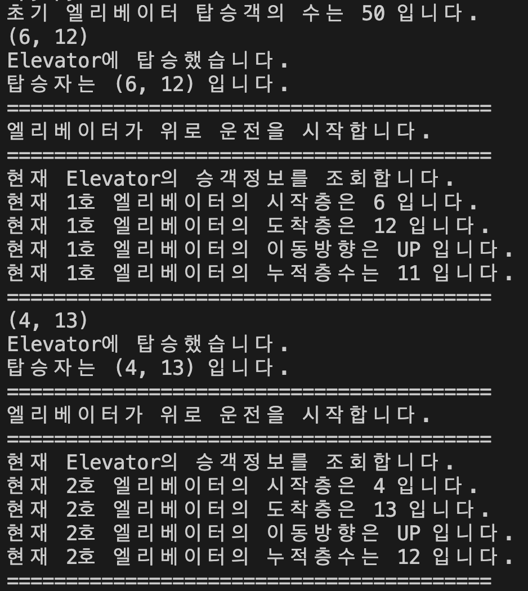
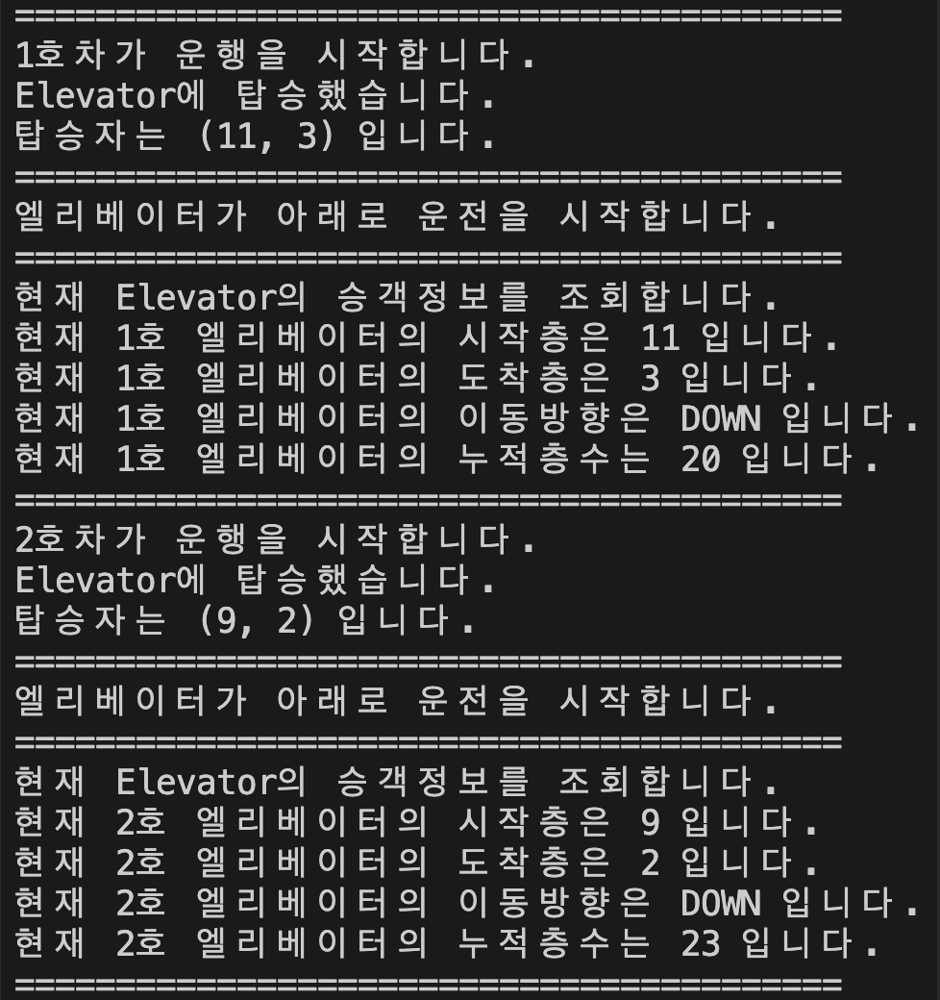
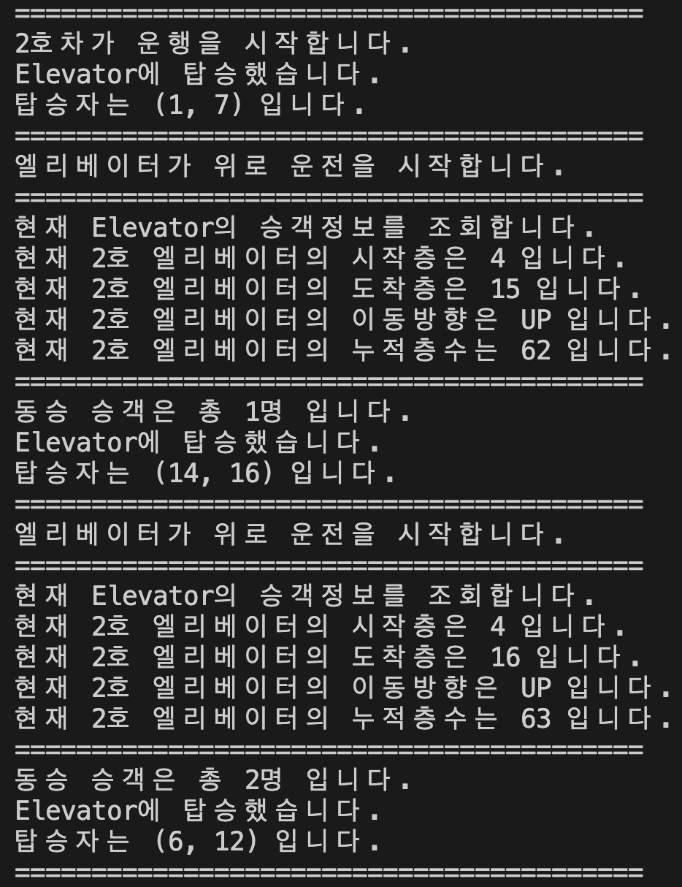

<link href="./style.css" rel="stylesheet"/>

# Mini project

## 공통과제

<section>

# <ins><b>시간이 오래 걸린 이유 분석 (Self-Feedback)</b></ins>

    - 장시간동안 논리적 생각하는 연습이 필요 (집중력이 떨어진다)
    - 논리적 사고력의 부족 (아직 연습이 많이 필요하다)
    - 문제에서 요구하는 조건처리의 타이밍을 정하는 부분에 대한 생각 및 구현 능력이 부족
    - 조건의 세분화와 객체를 설계할때 기능을 가능한한 작은 단위로 쪼개서 모듈화하는 것이 필요
    (기존에 기능을 세분화시켜서 모듈화시키지 않으면 기존 코드의 유지보수가 어렵다)
    - 변수명을 지을때 단수와 복수로 적으면 코드의 가독성은 높아지지만, 코드 작성시에 자동완성되어 의도하지 않은 실수가 생길 수 있기 때문에 간단한 변수명으로 대체하는 것이 좋다.

</section>

<section>

# <ins><b>Project Status</b></ins>

Issue #7 : <b><ins>[LeeHyungi0622] Solve Problem #7</ins></b>
[https://github.com/ulgoon/fcwps-project1/issues/7](https://github.com/ulgoon/fcwps-project1/issues/7)

</section>

<section>

# <ins><b>pseudo code</b></ins>

이번 과제는 Pseudo code작성을 기본적인 문제조건 작성에 초점을 맞춰 작성을 하였다. 기존 팀원들과 클래스 설계시에 필요한 내용에 대해서 회의하는 시간을 갖았기 때문에 Psedo code작성에는 시간을 많이 할애하지 않았다.
**<ins>이제부터 연습을 할때에는 Psedo code를 좀 더 간결하게 키워드로 작성을하고 머리로 생각 및 구현하는 연습을 해야 할 것 같다.</ins>**

</section>

<section>

# <ins><b>본 코드 작성</b></ins>

LeeHyungi / elevator.py 파일에 작성하였습니다.

</section>

<section>

# <ins><b>결과 출력화면</b></ins>

전제조건 : 모든 Elevator는 1층부터 시작하며, 누적된 층수는 첫 탑승자의 시작 층을 더하며 시작한다.

<table>
    <tr>
        <td>
            
        </td>
        <td>
            
        </td>
        <td>
            
        </td>
    </tr>
    <tr>
        <td align="center">
            <b>1호 / 2호 Elevator 초기 탑승자 설정</b>
        </td>
        <td align="center">
            <b>탑승객이 탈 Elevator를 가까운 위치의 Elevator로 선택 </b>
        </td>
        <td>
            <b>해당 Elevator의 동승 승객 명 수를 표시</b>
        </td>
    </tr>
</table>
</section>

## 선택과제 : 하노이 타워

<section>

## <ins><b>pseudo code</b></ins>

재귀호출을 통해서 원반을 옮기는 문제이다.

강사님이 첨부해주신 위키피디아 문서를 통해 힌트를 얻어서 풀 수 있었다.

</section>

<section>

# <ins><b>Project Status</b></ins>

Issue #7 : <b><ins>[LeeHyungi0622] Solve Problem #7</ins></b>
[https://github.com/ulgoon/fcwps-project1/issues/7](https://github.com/ulgoon/fcwps-project1/issues/7)

</section>

<section>

# <ins><b>본 코드 작성</b></ins>

LeeHyungi / hanoi.py 파일에 작성하였습니다.

</section>
